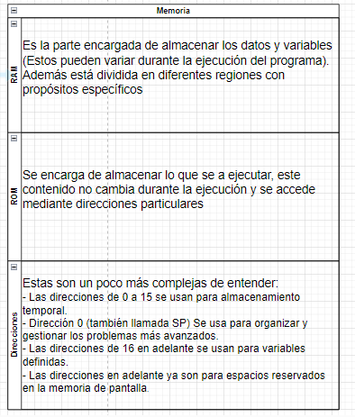
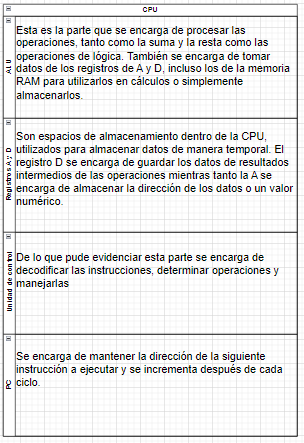

##### Componentes principales de la arquitectura Hack #####

##### Contador de programa (PC): ¿Cuál es su función en el ciclo Fetch-Decode-Execute? #####
El pc cumple con la función de organizar y almacenar la instrucción, luego fetch nos da la dirección y luego decode decodifica y evalua la operación que se va a realizar, por último execute realiza la instrucción y actualiza la dirección.

