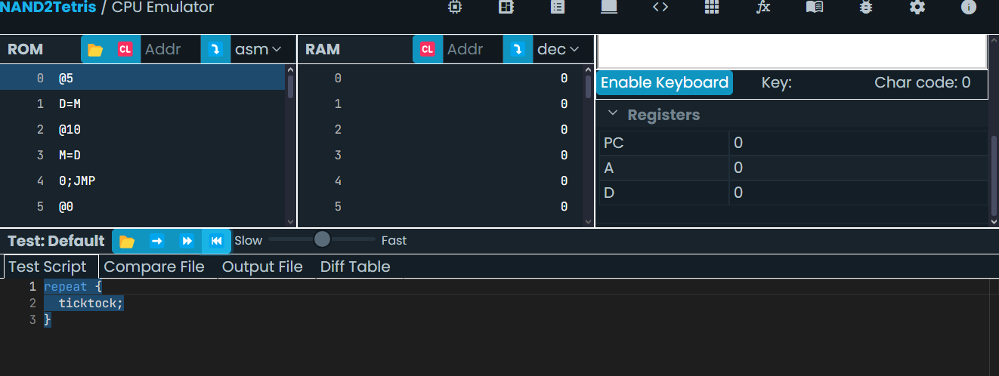
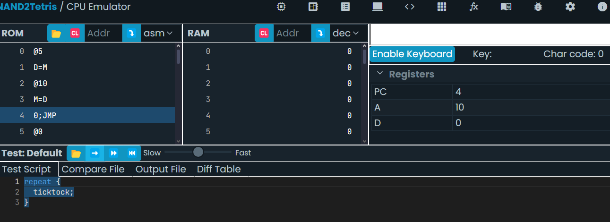

##### ¿Qué valor tiene el PC al inicio del ciclo? #####
- Como se evidencia en la imagen adjuntada, el PC al inicio del ciclo se encuentra en cero

##### ¿Qué instrucción se busca en la memoria? #####
- La instrucción D = M busca un valor en la memoria (5)

